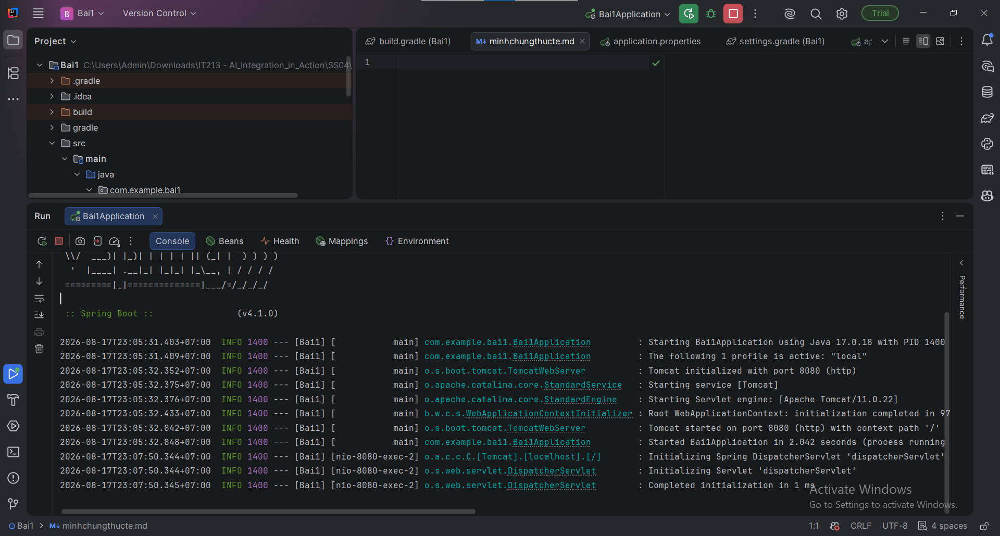
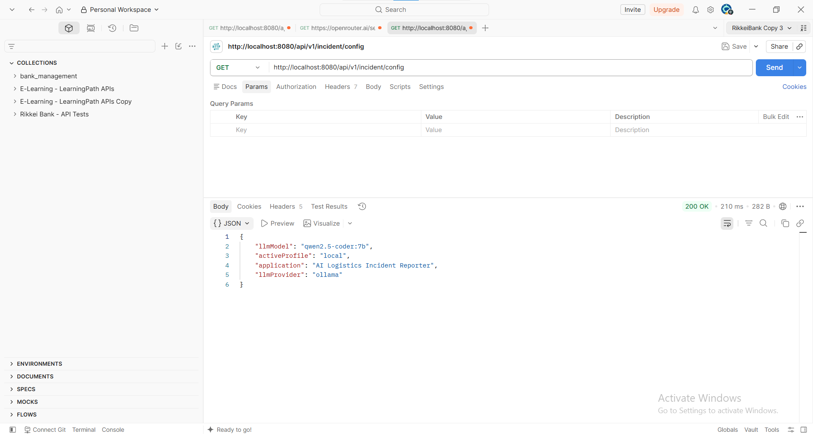
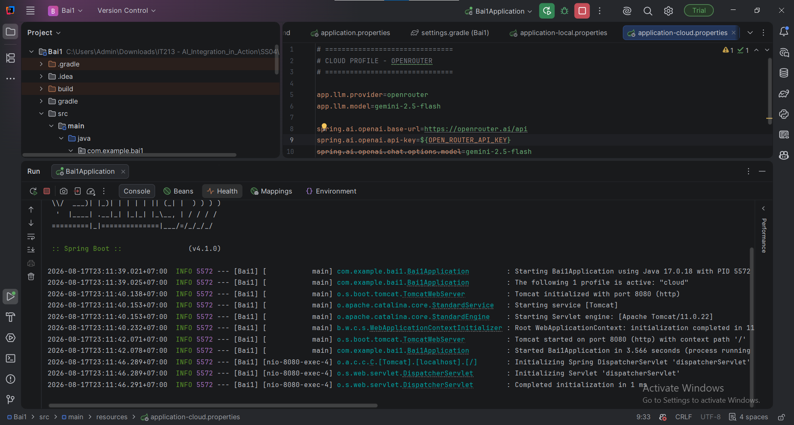
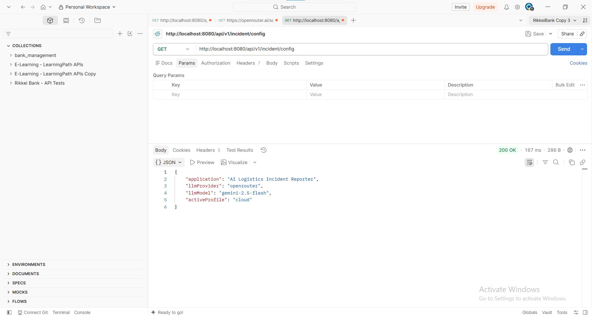

# Spring Boot Profiles – AI Logistics Incident Reporter

## 1. Mục tiêu

Hệ thống sử dụng **Spring Boot Profiles** để chuyển đổi linh hoạt giữa hai môi trường:

* **Local:** sử dụng `qwen2.5-coder:7b` thông qua Ollama tại `localhost:11434`.
* **Cloud:** sử dụng `gemini-2.5-flash` thông qua OpenRouter.
* Không cần thay đổi mã nguồn Java khi chuyển môi trường.

## 2. Ba file cấu hình

### `application.properties`

```properties
spring.application.name=ai-logistics-incident-reporter
spring.profiles.active=local
```

File này chứa cấu hình chung và chỉ định profile mặc định là `local`.

### `application-local.properties`

```properties
spring.ai.ollama.base-url=http://localhost:11434
spring.ai.ollama.chat.options.model=qwen2.5-coder:7b
```

Khi profile `local` được kích hoạt, Spring AI kết nối tới Ollama chạy trên cổng `11434`.

### `application-cloud.properties`

```properties
spring.ai.openai.base-url=https://openrouter.ai/api
spring.ai.openai.api-key=${ROUTER_API_KEY}
spring.ai.openai.chat.options.model=gemini-2.5-flash
```

Khi profile `cloud` được kích hoạt, API Key được lấy từ biến môi trường `ROUTER_API_KEY`, giúp tránh ghi trực tiếp secret vào source code.

## 3. Controller kiểm tra model đang hoạt động

`SystemConfigController` sử dụng giá trị cấu hình `spring.ai.chat.model` hoặc một property model riêng để trả về thông tin model hiện tại.

Ví dụ:

```java
@RestController
@RequestMapping("/api/v1/incident")
public class SystemConfigController {

    @Value("${spring.ai.chat.options.model:unknown}")
    private String model;

    @GetMapping("/config")
    public Map<String, String> getConfig() {
        return Map.of(
                "activeProfile",
                System.getProperty("spring.profiles.active", "local"),
                "llmModel",
                model
        );
    }
}
```

Endpoint:

```text
GET /api/v1/incident/config
```

Mục đích của endpoint là giúp kiểm tra nhanh ứng dụng đang nhận cấu hình model nào.

## 4. Cơ chế Spring Boot Profiles

Spring Boot cho phép tách cấu hình theo từng môi trường bằng các file:

```text
application.properties
application-local.properties
application-cloud.properties
```

Khi chạy:

```bash
java -jar app.jar --spring.profiles.active=local
```

Spring Boot sẽ nạp:

```text
application.properties
application-local.properties
```

Khi chạy:

```bash
java -jar app.jar --spring.profiles.active=cloud
```

Spring Boot sẽ nạp:

```text
application.properties
application-cloud.properties
```

Cấu hình của profile được kích hoạt sẽ ghi đè các giá trị tương ứng trong cấu hình chung.

Nhờ cơ chế này, cùng một mã nguồn Java có thể chạy với nhiều hạ tầng AI khác nhau mà không cần sửa Service hoặc Controller.

## 5. Chuyển đổi giữa Local và Cloud

Có thể chuyển profile bằng tham số:

```bash
--spring.profiles.active=local
```

hoặc:

```bash
--spring.profiles.active=cloud
```

Trong môi trường Cloud, cần khai báo biến môi trường:

```text
ROUTER_API_KEY=<your-api-key>
```

Sau đó Spring Boot tự động thay thế:

```properties
spring.ai.openai.api-key=${ROUTER_API_KEY}
```

bằng giá trị thực tế của biến môi trường.

## 6. Minh chứng chạy thực tế

### Profile Local

```text
The following 1 profile is active: "local"

...
Started AiLogisticsIncidentReporterApplication
```

Kiểm tra endpoint:

```text
GET /api/v1/incident/config
```

Kết quả mong đợi:

```json
{
  "activeProfile": "local",
  "llmModel": "qwen2.5-coder:7b"
}
```

### Profile Cloud

Chạy:

```bash
java -jar app.jar --spring.profiles.active=cloud
```

Console:

```text
The following 1 profile is active: "cloud"

...
Started AiLogisticsIncidentReporterApplication
```

Kết quả endpoint:

```json
{
  "activeProfile": "cloud",
  "llmModel": "gemini-2.5-flash"
}
```

## 7. Kết luận

Spring Boot Profiles giúp hệ thống **AI Logistics Incident Reporter** triển khai theo mô hình Hybrid AI một cách linh hoạt.

* Local sử dụng Ollama để bảo mật dữ liệu và tiết kiệm chi phí.
* Cloud sử dụng OpenRouter để truy cập các model AI bên ngoài.
* API Key được quản lý bằng biến môi trường.
* Việc thay đổi môi trường chỉ cần thay đổi `spring.profiles.active`.
* Không cần sửa mã nguồn Java khi chuyển từ Local sang Cloud.

Đây là cách tiếp cận phù hợp để tách biệt **configuration** khỏi **business logic**, giúp hệ thống dễ triển khai, bảo trì và mở rộng.


Local



Cloud

