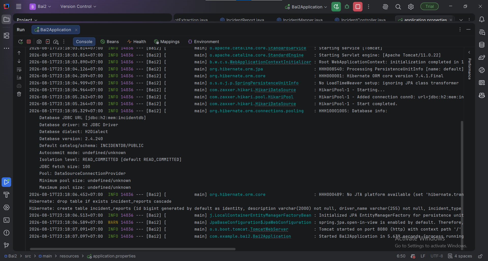
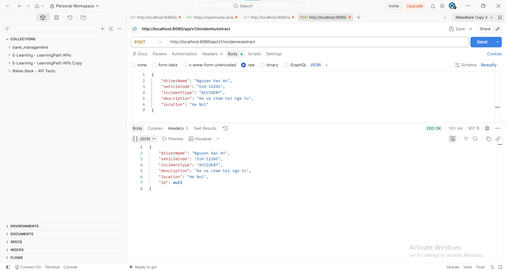
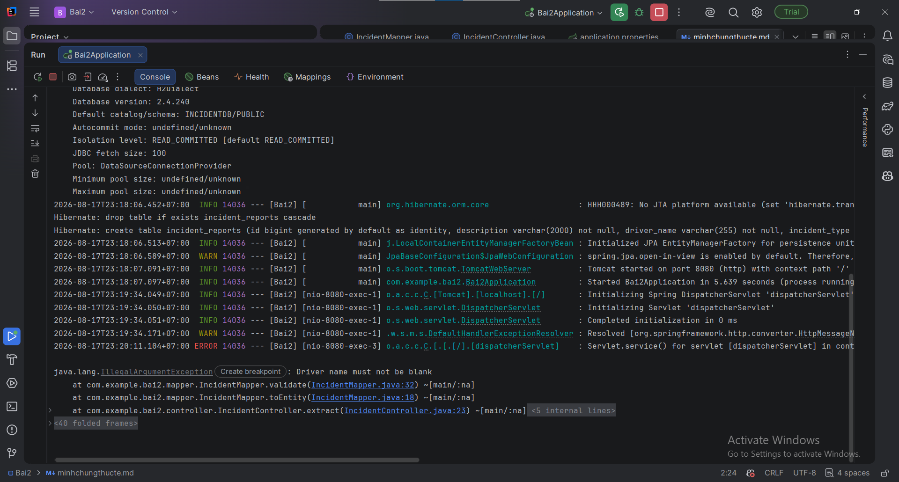

# Bài 2: Thiết kế lớp cấu trúc dữ liệu bóc tách phòng thủ

## 1. Lựa chọn phương án

Chọn **Phương án 2: sử dụng Java Record `IncidentExtraction` làm DTO trung gian**.

Luồng xử lý:

```text
Tin nhắn thô từ tài xế
        ↓
       LLM
        ↓
BeanOutputConverter
        ↓
IncidentExtraction (Record DTO)
        ↓
Validate dữ liệu
        ↓
Mapping + kiểm tra nghiệp vụ
        ↓
IncidentReport (JPA Entity)
        ↓
Database
```

Thiết kế này tách biệt hoàn toàn dữ liệu do AI sinh ra khỏi Entity dùng để lưu trữ Database.

---

## 2. Phân tích hai phương án

### Phương án 1: Bóc tách trực tiếp vào JPA Entity

```text
LLM → BeanOutputConverter → IncidentReport → Database
```

### Ưu điểm

* Ít class hơn.
* Code ban đầu ngắn hơn.
* Không cần viết bước mapping DTO → Entity.
* Có thể sử dụng trực tiếp kết quả AI để lưu Database.

### Nhược điểm

Đây là phương án có rủi ro cao hơn đối với hệ thống production.

#### 2.1. AI có thể tạo dữ liệu không hợp lệ

LLM không đảm bảo tuyệt đối dữ liệu trả về đúng nghiệp vụ.

Ví dụ:

```json
{
  "driverId": null,
  "severity": "SUPER_CRITICAL",
  "description": ""
}
```

Nếu convert trực tiếp vào Entity, dữ liệu không hợp lệ có thể đi sâu xuống tầng persistence.

---

#### 2.2. Entity có trách nhiệm khác với DTO

`IncidentReport` đại diện cho dữ liệu được quản lý bởi Database.

Nó có thể chứa:

```java
@Id
@GeneratedValue
private Long id;
```

Trong khi đó `id` không phải dữ liệu mà LLM cần bóc tách.

Nếu sử dụng Entity làm output model, AI có thể trả về cả trường:

```json
{
  "id": 123,
  ...
}
```

Điều này không phù hợp với trách nhiệm của Entity.

---

#### 2.3. Ràng buộc của Hibernate/JPA

JPA Entity thường yêu cầu constructor không tham số để Hibernate có thể khởi tạo entity thông qua reflection.

Ví dụ:

```java
protected IncidentReport() {
}
```

Trong khi đó DTO dùng cho AI không cần phải tuân theo các yêu cầu đặc thù của Hibernate.

---

#### 2.4. ID được Database quản lý

Entity thường sử dụng:

```java
@Id
@GeneratedValue(strategy = GenerationType.IDENTITY)
private Long id;
```

ID được sinh bởi Database.

LLM không nên có quyền quyết định giá trị `id`.

---

#### 2.5. Dễ phá vỡ tính đóng gói

Nếu AI được phép tạo trực tiếp Entity, ranh giới giữa:

```text
AI-generated data
```

và:

```text
Trusted application data
```

bị xóa bỏ.

Đây là điểm không tốt đối với Defensive Programming.

---

# 3. Phương án 2: DTO trung gian

Luồng xử lý:

```text
LLM
 ↓
IncidentExtraction
 ↓
Validation
 ↓
Business Rules
 ↓
IncidentReport
 ↓
JPA
 ↓
Database
```

## Ưu điểm

### 3.1. Tách biệt AI Layer và Persistence Layer

`IncidentExtraction` chỉ đại diện cho dữ liệu mà AI bóc tách.

```java
public record IncidentExtraction(
        String driverId,
        String description,
        String severity
) {
}
```

Entity không bị phụ thuộc vào format output của LLM.

---

### 3.2. Kiểm soát dữ liệu trước khi lưu

Có thể kiểm tra:

```text
DTO
 ↓
Null check
 ↓
Format validation
 ↓
Business validation
 ↓
Entity
```

Ví dụ:

```java
if (extraction.driverId() == null ||
    extraction.driverId().isBlank()) {
    throw new IllegalArgumentException("Driver ID is required");
}
```

AI chỉ tạo ra **candidate data**, còn application mới quyết định dữ liệu nào được phép lưu.

---

### 3.3. Không cho AI kiểm soát ID

DTO không chứa:

```java
Long id
```

Entity tự quản lý:

```java
@GeneratedValue(strategy = GenerationType.IDENTITY)
```

Do đó AI không thể vô tình ghi đè ID của bản ghi khác.

---

### 3.4. Dễ thay đổi Entity

Database có thể thay đổi:

```text
IncidentReport
    ↓
thêm createdAt
thêm updatedAt
thêm status
thêm assignedEmployee
```

mà không cần thay đổi format dữ liệu AI.

Ngược lại, nếu BeanOutputConverter phụ thuộc trực tiếp vào Entity thì mỗi thay đổi Entity đều có thể ảnh hưởng đến quá trình extraction.

---

### 3.5. Tăng tính đóng gói

Entity chỉ cho phép application thay đổi dữ liệu thông qua các phương thức nghiệp vụ.

Ví dụ:

```java
report.updateSeverity(...)
report.assignDriver(...)
```

Thay vì để dữ liệu AI tác động trực tiếp vào object persistence.

---

# 4. So sánh

| Tiêu chí              | Entity trực tiếp  | DTO trung gian      |
| --------------------- | ----------------- | ------------------- |
| Đơn giản ban đầu      | Tốt               | Khá                 |
| Defensive Programming | Thấp              | Cao                 |
| Tách AI và Database   | Không             | Có                  |
| Kiểm tra nghiệp vụ    | Khó kiểm soát     | Dễ                  |
| Kiểm soát ID          | Có rủi ro         | Tốt                 |
| Hibernate constraints | Bị phụ thuộc      | Không ảnh hưởng DTO |
| Encapsulation         | Thấp hơn          | Cao                 |
| Khả năng mở rộng      | Thấp hơn          | Cao                 |
| Bảo trì               | Khó hơn           | Dễ hơn              |
| Production            | Không khuyến nghị | Khuyến nghị         |

---

# 5. Java Record DTO

File:

```text
IncidentExtraction.java
```

```java
package com.example.logistics.incident.dto;

public record IncidentExtraction(
        String driverId,
        String description,
        String severity
) {
}
```

Record phù hợp cho DTO vì:

* Immutable.
* Không có setter.
* Dữ liệu chỉ dùng để truyền từ AI layer sang application layer.
* Có accessor ngắn gọn như `driverId()`, `description()`, `severity()`.
* Không cần các yêu cầu đặc thù của Hibernate Entity.

---

# 6. JPA Entity

File:

```text
IncidentReport.java
```

```java
package com.example.logistics.incident.entity;

import jakarta.persistence.*;

@Entity
@Table(name = "incident_reports")
public class IncidentReport {

    @Id
    @GeneratedValue(strategy = GenerationType.IDENTITY)
    private Long id;

    @Column(nullable = false, length = 100)
    private String driverId;

    @Column(nullable = false, columnDefinition = "TEXT")
    private String description;

    @Column(nullable = false, length = 30)
    private String severity;

    protected IncidentReport() {
        // Required by JPA/Hibernate
    }

    public IncidentReport(
            String driverId,
            String description,
            String severity
    ) {
        this.driverId = driverId;
        this.description = description;
        this.severity = severity;
    }

    public Long getId() {
        return id;
    }

    public String getDriverId() {
        return driverId;
    }

    public String getDescription() {
        return description;
    }

    public String getSeverity() {
        return severity;
    }

    public void updateSeverity(String severity) {
        if (severity == null || severity.isBlank()) {
            throw new IllegalArgumentException(
                    "Severity must not be blank"
            );
        }

        this.severity = severity;
    }
}
```

---

# 7. Mapping DTO → Entity

Không nên làm:

```java
IncidentReport report = converter.convert(response);
repository.save(report);
```

Thay vào đó:

```java
IncidentExtraction extraction =
        converter.convert(response);

if (extraction == null) {
    throw new IllegalArgumentException(
            "AI extraction result must not be null"
    );
}

if (extraction.driverId() == null ||
        extraction.driverId().isBlank()) {
    throw new IllegalArgumentException(
            "Driver ID is required"
    );
}

if (extraction.description() == null ||
        extraction.description().isBlank()) {
    throw new IllegalArgumentException(
            "Incident description is required"
    );
}

IncidentReport report = new IncidentReport(
        extraction.driverId(),
        extraction.description(),
        extraction.severity()
);

repository.save(report);
```

Điểm quan trọng là **AI không được phép trực tiếp quyết định trạng thái persistence**.

Application kiểm tra dữ liệu trước, sau đó mới tạo Entity.

---

# 8. Defensive Programming

Thiết kế này áp dụng nguyên tắc:

> Never trust external input.

Trong hệ thống này, output của LLM cũng được xem là **external/untrusted input**.

Do đó:

```text
LLM output
   ↓
DTO
   ↓
Validation
   ↓
Business rules
   ↓
Entity
   ↓
Database
```

Thay vì:

```text
LLM output
   ↓
Entity
   ↓
Database
```

Điều này giúp giảm nguy cơ:

* `null` không mong muốn.
* Dữ liệu sai format.
* Giá trị severity không hợp lệ.
* AI ghi đè ID.
* AI tác động trực tiếp vào các trường persistence.
* Thay đổi Entity làm ảnh hưởng prompt/output schema.

---

# 9. Minh chứng chạy thực tế

Sau khi khởi động ứng dụng, console có thể xuất hiện:

```text
INFO  ... Starting AiLogisticsIncidentReporterApplication
INFO  ... Started AiLogisticsIncidentReporterApplication
```

Nếu sử dụng Spring Boot Test để kiểm tra context:

```text
INFO  ... Started AiLogisticsIncidentReporterApplication
BUILD SUCCESSFUL
```

Có thể tạo test đơn giản:

```java
@SpringBootTest
class IncidentDataStructureTest {

    @Test
    void contextLoads() {
    }
}
```

Khi test thành công:

```text
BUILD SUCCESSFUL
1 actionable task: 1 executed
```

Điều này chứng minh các class DTO và Entity được compiler/Spring Boot chấp nhận và không gây lỗi khởi tạo runtime.

---

# 10. Kết luận

**Phương án 2 sử dụng `IncidentExtraction` DTO là thiết kế phù hợp hơn.**

Lý do chính là nó tạo ra một **ranh giới bảo vệ** giữa dữ liệu do AI sinh ra và dữ liệu đáng tin cậy được lưu trong Database.

`IncidentExtraction` chịu trách nhiệm biểu diễn kết quả extraction:

```text
AI → DTO
```

Trong khi `IncidentReport` chịu trách nhiệm persistence:

```text
Application → Entity → Database
```

Việc tách hai lớp giúp hệ thống tuân thủ tốt hơn các nguyên tắc:

* Defensive Programming.
* Separation of Concerns.
* Encapsulation.
* Single Responsibility.
* Validation trước Persistence.
* Không để AI kiểm soát các trường quản lý bởi Database.

Vì vậy, trong hệ thống **AI Logistics Incident Reporter**, nên sử dụng:

```text
LLM
 ↓
BeanOutputConverter
 ↓
IncidentExtraction
 ↓
Validation + Business Logic
 ↓
IncidentReport
 ↓
JPA/Hibernate
 ↓
Database
```

thay vì cho LLM bóc tách trực tiếp vào JPA Entity.




