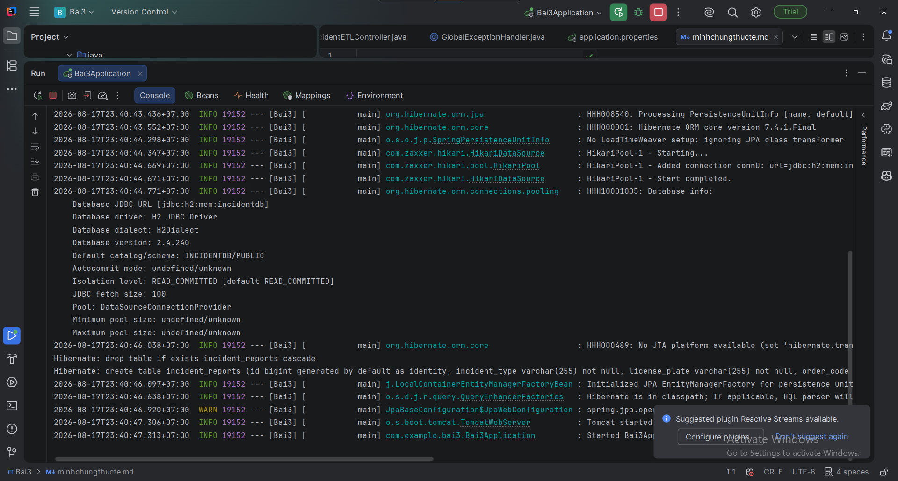
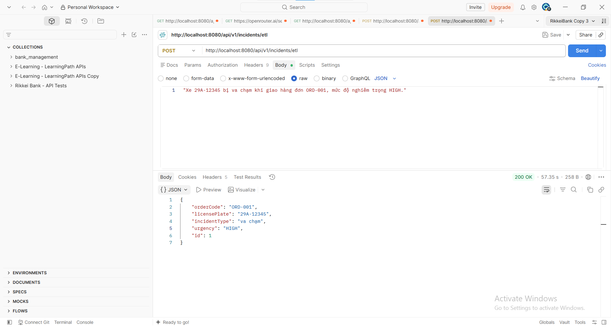
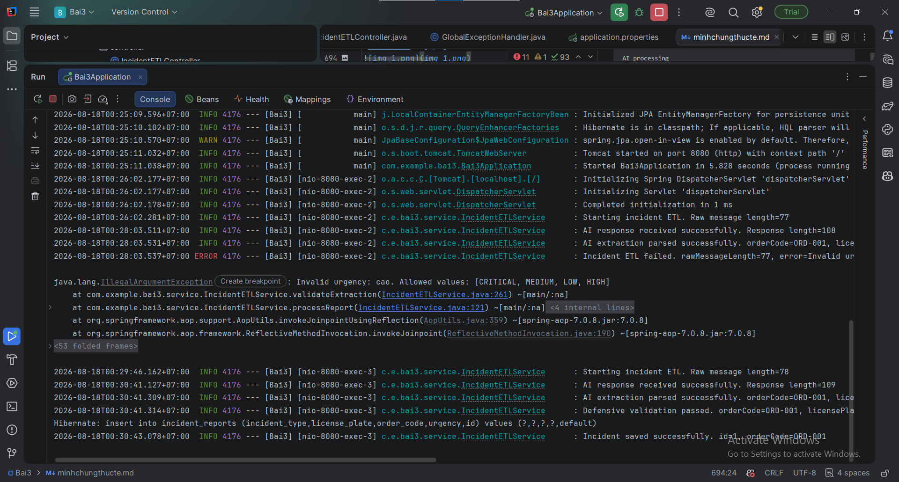

# Bài 3: Tối ưu & Refactor mã nguồn ETL phòng thủ

## 1. Mục tiêu refactor

Luồng ETL sau khi refactor:

```text
Raw Message
    ↓
ChatModel
    ↓
AI Response
    ↓
Clean Markdown
    ↓
BeanOutputConverter
    ↓
IncidentExtraction DTO
    ↓
Defensive Validation
    ↓
Mapping
    ↓
IncidentReport Entity
    ↓
Repository.save()
    ↓
Database
```

Các vấn đề được xử lý:

* Loại bỏ Markdown code block khỏi response của LLM.
* Kiểm tra dữ liệu DTO trước khi tạo Entity.
* Kiểm tra `orderCode`.
* Kiểm tra định dạng `licensePlate`.
* Kiểm tra `urgency`.
* Rollback transaction khi xảy ra lỗi.
* Logging đầy đủ bằng SLF4J.
* Không để dữ liệu không đáng tin cậy từ AI đi thẳng xuống Database.

---

# 2. Enum `Urgency`

```java
package com.example.logistics.incident.model;

public enum Urgency {

    LOW,
    MEDIUM,
    HIGH,
    CRITICAL
}
```

---

# 3. IncidentETLService

````java
package com.example.logistics.incident.service;

import com.example.logistics.incident.dto.IncidentExtraction;
import com.example.logistics.incident.entity.IncidentReport;
import com.example.logistics.incident.model.Urgency;
import com.example.logistics.incident.repository.IncidentRepository;
import org.slf4j.Logger;
import org.slf4j.LoggerFactory;
import org.springframework.ai.chat.model.ChatModel;
import org.springframework.ai.chat.prompt.Prompt;
import org.springframework.ai.converter.BeanOutputConverter;
import org.springframework.stereotype.Service;
import org.springframework.transaction.annotation.Transactional;

import java.util.regex.Pattern;

@Service
public class IncidentETLService {

    private static final Logger log =
            LoggerFactory.getLogger(IncidentETLService.class);

    private static final Pattern LICENSE_PLATE_PATTERN =
            Pattern.compile("^[0-9]{2}[A-Z]{1,2}[- ]?[0-9]{4,5}$");

    private final ChatModel chatModel;
    private final IncidentRepository repository;

    public IncidentETLService(
            ChatModel chatModel,
            IncidentRepository repository
    ) {
        this.chatModel = chatModel;
        this.repository = repository;
    }

    @Transactional
    public IncidentReport processReport(String rawMessage) {

        if (rawMessage == null || rawMessage.isBlank()) {
            throw new IllegalArgumentException(
                    "Raw incident message must not be blank"
            );
        }

        log.info(
                "Starting incident ETL. messageLength={}",
                rawMessage.length()
        );

        try {

            /*
             * 1. Create converter
             */
            BeanOutputConverter<IncidentExtraction> converter =
                    new BeanOutputConverter<>(IncidentExtraction.class);

            String formatInstructions =
                    converter.getFormatInstructions();

            /*
             * 2. Build prompt
             */
            String promptText = """
                    Phân tích tin nhắn sự cố của tài xế.

                    Chỉ trả về JSON hợp lệ.
                    Không sử dụng Markdown code block.

                    Tin nhắn:
                    %s

                    %s
                    """.formatted(
                    rawMessage,
                    formatInstructions
            );

            Prompt prompt = new Prompt(promptText);

            /*
             * 3. Call LLM
             */
            String response = chatModel
                    .call(prompt)
                    .getResult()
                    .getOutput()
                    .getContent();

            if (response == null || response.isBlank()) {
                throw new IllegalStateException(
                        "AI returned an empty response"
                );
            }

            /*
             * 4. Clean AI response
             */
            String cleanedResponse =
                    cleanJsonResponse(response);

            log.debug(
                    "AI response cleaned successfully. length={}",
                    cleanedResponse.length()
            );

            /*
             * 5. Parse JSON → DTO
             */
            IncidentExtraction dto =
                    converter.convert(cleanedResponse);

            if (dto == null) {
                throw new IllegalStateException(
                        "AI response could not be converted to IncidentExtraction"
                );
            }

            log.info(
                    "AI response parsed successfully. orderCode={}",
                    dto.orderCode()
            );

            /*
             * 6. Defensive validation
             */
            validateExtraction(dto);

            /*
             * 7. Mapping DTO → Entity
             */
            IncidentReport entity =
                    new IncidentReport();

            entity.setOrderCode(dto.orderCode());
            entity.setLicensePlate(dto.licensePlate());
            entity.setIncidentType(dto.incidentType());
            entity.setUrgency(dto.urgency());

            /*
             * 8. Persist
             */
            IncidentReport saved =
                    repository.save(entity);

            log.info(
                    "Incident ETL completed successfully. orderCode={}, id={}",
                    saved.getOrderCode(),
                    saved.getId()
            );

            return saved;

        } catch (Exception ex) {

            log.error(
                    "Incident ETL failed and transaction will be rolled back. " +
                    "messageLength={}, errorType={}, errorMessage={}",
                    rawMessage.length(),
                    ex.getClass().getSimpleName(),
                    ex.getMessage(),
                    ex
            );

            throw ex;
        }
    }

    /**
     * Removes Markdown code fences from LLM response.
     */
    private String cleanJsonResponse(String response) {

        String cleaned = response.trim();

        cleaned = cleaned.replaceFirst(
                "^```(?:json)?\\s*",
                ""
        );

        cleaned = cleaned.replaceFirst(
                "\\s*```$",
                ""
        );

        return cleaned.trim();
    }

    /**
     * Defensive validation for AI-generated data.
     */
    private void validateExtraction(
            IncidentExtraction dto
    ) {

        /*
         * orderCode
         */
        if (dto.orderCode() == null ||
                dto.orderCode().isBlank()) {

            throw new IllegalArgumentException(
                    "orderCode must not be blank"
            );
        }

        /*
         * licensePlate
         */
        if (dto.licensePlate() == null ||
                dto.licensePlate().isBlank()) {

            throw new IllegalArgumentException(
                    "licensePlate must not be blank"
            );
        }

        if (!LICENSE_PLATE_PATTERN
                .matcher(dto.licensePlate().trim().toUpperCase())
                .matches()) {

            throw new IllegalArgumentException(
                    "Invalid license plate format: "
                            + dto.licensePlate()
            );
        }

        /*
         * incidentType
         */
        if (dto.incidentType() == null ||
                dto.incidentType().isBlank()) {

            throw new IllegalArgumentException(
                    "incidentType must not be blank"
            );
        }

        /*
         * urgency
         */
        if (dto.urgency() == null ||
                dto.urgency().isBlank()) {

            throw new IllegalArgumentException(
                    "urgency must not be blank"
            );
        }

        try {

            Urgency.valueOf(
                    dto.urgency()
                            .trim()
                            .toUpperCase()
            );

        } catch (IllegalArgumentException ex) {

            throw new IllegalArgumentException(
                    "Invalid urgency: " + dto.urgency()
                            + ". Allowed values: LOW, MEDIUM, HIGH, CRITICAL"
            );
        }
    }
}
````

---

# 4. IncidentExtraction DTO

```java
package com.example.logistics.incident.dto;

public record IncidentExtraction(
        String orderCode,
        String licensePlate,
        String incidentType,
        String urgency
) {
}
```

DTO chỉ chứa dữ liệu được AI bóc tách.

Không đưa các trường persistence như:

```text
id
createdAt
updatedAt
```

vào DTO.

---

# 5. Vì sao phải làm sạch Markdown?

LLM đôi khi trả về:

````text
```json
{
  "orderCode": "ORD-001",
  "licensePlate": "29A-12345",
  "incidentType": "ACCIDENT",
  "urgency": "HIGH"
}
````

````

Trong khi `BeanOutputConverter` cần JSON thuần:

```json
{
  "orderCode": "ORD-001",
  "licensePlate": "29A-12345",
  "incidentType": "ACCIDENT",
  "urgency": "HIGH"
}
````

Nếu đưa nguyên response vào Jackson parser, các ký tự:

````text
```json
````

và:

```text
```

````

có thể khiến quá trình deserialize thất bại.

Do đó application nên có một bước normalization trước khi parse.

---

# 6. Vì sao JSON Schema/Format Instructions vẫn chưa đủ?

Đây là phần quan trọng nhất của bài.

`BeanOutputConverter.getFormatInstructions()` giúp hướng dẫn LLM trả về dữ liệu theo cấu trúc mong muốn.

Ví dụ:

```text
orderCode
licensePlate
incidentType
urgency
````

Tuy nhiên, **format đúng không đồng nghĩa với dữ liệu đúng nghiệp vụ**.

## 6.1. JSON hợp lệ nhưng dữ liệu sai

LLM có thể trả về:

```json
{
  "orderCode": null,
  "licensePlate": null,
  "incidentType": "ACCIDENT",
  "urgency": "HIGH"
}
```

Đây vẫn có thể là JSON hợp lệ.

Parser không biết rằng:

```text
orderCode bắt buộc phải có
licensePlate bắt buộc phải có
```

---

## 6.2. Giá trị enum có thể sai

LLM có thể trả:

```json
{
  "orderCode": "ORD-001",
  "licensePlate": "29A-12345",
  "incidentType": "ACCIDENT",
  "urgency": "VERY_HIGH"
}
```

JSON vẫn hợp lệ.

Nhưng hệ thống chỉ cho phép:

```text
LOW
MEDIUM
HIGH
CRITICAL
```

Do đó phải kiểm tra:

```java
Urgency.valueOf(dto.urgency());
```

---

## 6.3. Regex nghiệp vụ không thể chỉ dựa vào LLM

LLM có thể trả:

```text
licensePlate = "HELLO123"
```

Dữ liệu vẫn là String hợp lệ.

Nhưng đây không phải biển số xe hợp lệ theo rule của hệ thống.

Vì vậy cần:

```java
LICENSE_PLATE_PATTERN.matcher(...).matches()
```

---

# 7. Nguyên tắc Defensive Programming

Dữ liệu từ LLM phải được coi là:

> Untrusted input.

Không nên thiết kế:

```text
LLM
 ↓
Entity
 ↓
Database
```

Mà phải thiết kế:

```text
LLM
 ↓
DTO
 ↓
Parse
 ↓
Validation
 ↓
Business Rules
 ↓
Entity
 ↓
Database
```

AI chỉ đưa ra **đề xuất dữ liệu**.

Application mới là thành phần quyết định dữ liệu đó có được phép lưu hay không.

---

# 8. Transaction và Rollback

Service sử dụng:

```java
@Transactional
```

Điều này đảm bảo thao tác Database trong transaction có thể rollback khi xảy ra Runtime Exception.

Ví dụ:

```text
AI parse
 ↓
Validation
 ↓
Entity
 ↓
repository.save()
 ↓
Database Error
 ↓
ROLLBACK
```

Hoặc:

```text
AI parse
 ↓
Validation FAILED
 ↓
Exception
 ↓
ROLLBACK
```

Đặc biệt, transaction không nên được dùng để giữ một transaction Database mở trong suốt một cuộc gọi LLM kéo dài ở production nếu không cần thiết.

Trong bài tập này, `@Transactional` thể hiện yêu cầu quản lý transaction của ETL. Với hệ thống production lớn, có thể tách:

```text
AI processing
        ↓
validated DTO
        ↓
short DB transaction
        ↓
save
```

để tránh giữ Database connection trong thời gian gọi LLM.

---

# 9. Logging

Luồng thành công:

```text
INFO  Starting incident ETL. messageLength=86
INFO  AI response parsed successfully. orderCode=ORD-001
INFO  Incident ETL completed successfully. orderCode=ORD-001, id=15
```

Luồng lỗi validation:

```text
INFO  Starting incident ETL. messageLength=75
INFO  AI response parsed successfully. orderCode=null

ERROR Incident ETL failed and transaction will be rolled back.
messageLength=75,
errorType=IllegalArgumentException,
errorMessage=orderCode must not be blank
```

Luồng lỗi Database:

```text
INFO  Starting incident ETL. messageLength=86
INFO  AI response parsed successfully. orderCode=ORD-001

ERROR Incident ETL failed and transaction will be rolled back.
messageLength=86,
errorType=DataIntegrityViolationException,
errorMessage=...
```

Không nên log toàn bộ raw message nếu message có thể chứa dữ liệu nhạy cảm. Trong production nên ưu tiên log ID, độ dài message hoặc correlation ID.

---

# 10. Kết quả đạt được

Sau khi refactor, ETL Service có các lớp bảo vệ:

| Vấn đề                        | Giải pháp                                  |
| ----------------------------- | ------------------------------------------ |
| Markdown JSON                 | `cleanJsonResponse()`                      |
| JSON parse lỗi                | `BeanOutputConverter` + exception handling |
| `orderCode = null`            | Defensive validation                       |
| `licensePlate` sai format     | Regex validation                           |
| `urgency` sai enum            | `Urgency.valueOf()`                        |
| DB constraint error           | `@Transactional`                           |
| Khó debug                     | SLF4J logging                              |
| AI tác động trực tiếp Entity  | DTO trung gian                             |
| Dữ liệu AI không đáng tin cậy | Validation trước persistence               |

---

# 11. Kết luận

`JSON Schema` và `Format Instructions` chỉ giúp **định hướng và kiểm tra cấu trúc output**, không thể thay thế hoàn toàn business validation.

LLM là hệ thống xác suất nên có thể:

* bỏ sót trường;
* trả về `null`;
* trả về giá trị ngoài domain;
* hiểu sai nội dung;
* sinh dữ liệu hợp lệ về mặt JSON nhưng sai nghiệp vụ.

Do đó hệ thống phải luôn coi output của AI là **untrusted input**.

Thiết kế an toàn:

```text
Raw Message
    ↓
LLM
    ↓
Clean Response
    ↓
BeanOutputConverter
    ↓
IncidentExtraction
    ↓
Defensive Validation
    ↓
Business Rules
    ↓
IncidentReport
    ↓
@Transactional
    ↓
Database
```

Đây là kiến trúc ETL phù hợp hơn với yêu cầu **enterprise-grade, defensive và dễ bảo trì**.



