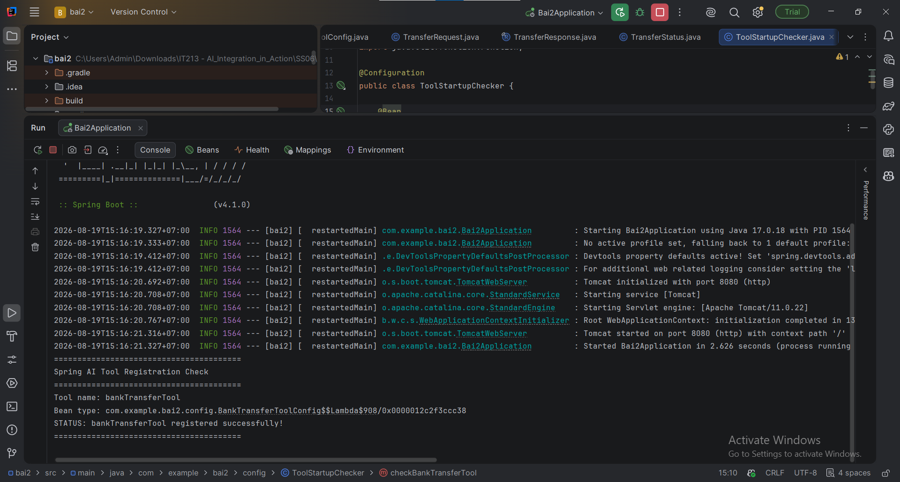

# RikkeiPay – Bài 2: Hiện thực hóa & Đăng ký Spring AI Tool

## 1. Giới thiệu

Bài tập này thực hiện việc đóng gói nghiệp vụ chuyển khoản ngân hàng của hệ thống **RikkeiPay** thành một `Spring Bean` có kiểu:

```java
Function<TransferRequest, TransferResponse>
```

Bean này đóng vai trò là một **AI Tool / Function Tool**, cho phép Spring AI cung cấp công cụ chuyển khoản cho mô hình LLM.

Hệ thống mô phỏng quá trình xử lý của **Core Banking** mà chưa kết nối với hệ thống ngân hàng thực tế.

---

## 2. Mục tiêu bài tập

Bài tập thực hiện các yêu cầu:

* Tạo `Function<TransferRequest, TransferResponse>`.
* Đăng ký Function dưới dạng Spring `@Bean`.
* Đặt tên Bean là `bankTransferTool`.
* Mô phỏng kiểm tra số dư tài khoản nguồn.
* Nếu số dư đủ, thực hiện giao dịch và trả về `SUCCESS`.
* Nếu số dư không đủ, trả về `FAILED`.
* Sinh `transactionId` ngẫu nhiên cho giao dịch thành công.
* Cung cấp metadata/description để LLM hiểu được mục đích và tham số của Tool.
* Kiểm tra Spring Context đã đăng ký thành công `bankTransferTool`.

---

## 3. Công nghệ sử dụng

* Java 25
* Spring Boot 4.1.0
* Spring AI
* Gradle
* Jakarta Validation
* `java.util.function.Function`

---

## 4. Cấu trúc project

```text
rikkeipay-bank-transfer-tool/
├── build.gradle
├── settings.gradle
├── README.md
└── src/
    └── main/
        └── java/
            └── com/
                └── rikkeipay/
                    ├── RikkeiPayApplication.java
                    │
                    ├── config/
                    │   ├── BankTransferToolConfig.java
                    │   └── ToolStartupChecker.java
                    │
                    └── dto/
                        ├── TransferRequest.java
                        ├── TransferResponse.java
                        └── TransferStatus.java
```

---

## 5. DTO đầu vào

`TransferRequest` đại diện cho dữ liệu yêu cầu chuyển khoản.

Các trường gồm:

| Trường                  | Kiểu dữ liệu | Ý nghĩa                 |
| ----------------------- | ------------ | ----------------------- |
| `senderAccountId`       | `Long`       | ID tài khoản nguồn      |
| `receiverAccountNumber` | `String`     | Số tài khoản người nhận |
| `bankCode`              | `String`     | Mã ngân hàng nhận       |
| `amount`                | `BigDecimal` | Số tiền chuyển          |
| `description`           | `String`     | Nội dung chuyển khoản   |

Ví dụ:

```json
{
  "senderAccountId": 1001,
  "receiverAccountNumber": "0123456789",
  "bankCode": "VCB",
  "amount": 1000000,
  "description": "Thanh toan tien hang"
}
```

---

## 6. DTO đầu ra

`TransferResponse` đại diện cho kết quả xử lý giao dịch.

Các trường:

| Trường          | Ý nghĩa               |
| --------------- | --------------------- |
| `transactionId` | Mã giao dịch duy nhất |
| `status`        | Trạng thái giao dịch  |
| `message`       | Thông báo kết quả     |

Trạng thái được định nghĩa bằng:

```java
public enum TransferStatus {
    SUCCESS,
    FAILED
}
```

---

## 7. Spring AI Tool – `bankTransferTool`

Tool được đăng ký bằng `@Bean`:

```java
@Bean
public Function<TransferRequest, TransferResponse> bankTransferTool() {
    ...
}
```

Tên Bean:

```text
bankTransferTool
```

Kiểu dữ liệu:

```text
Function<TransferRequest, TransferResponse>
```

Trong đó:

* `TransferRequest` là dữ liệu đầu vào.
* `TransferResponse` là dữ liệu đầu ra.

---

## 8. Logic xử lý giao dịch

Hệ thống giả lập tài khoản nguồn có số dư cố định:

```text
5.000.000 VND
```

Khi Tool nhận yêu cầu chuyển khoản, hệ thống thực hiện:

```text
TransferRequest
       │
       ▼
Kiểm tra số tiền chuyển
       │
       ▼
So sánh với số dư
       │
       ├── Đủ tiền ──────► SUCCESS
       │                    │
       │                    └── Sinh transactionId
       │
       └── Không đủ ─────► FAILED
                            │
                            └── Insufficient balance
```

### Trường hợp đủ tiền

Ví dụ chuyển:

```text
1.000.000 VND
```

Trong khi số dư là:

```text
5.000.000 VND
```

Kết quả:

```text
status = SUCCESS
```

và hệ thống sinh một `transactionId` ngẫu nhiên.

Ví dụ:

```text
TXN-xxxxxxxx-xxxx-xxxx-xxxx-xxxxxxxxxxxx
```

---

### Trường hợp không đủ tiền

Ví dụ chuyển:

```text
10.000.000 VND
```

Trong khi số dư chỉ:

```text
5.000.000 VND
```

Kết quả:

```text
status = FAILED
```

Thông báo:

```text
Insufficient balance
```

---

## 9. Tool Description

Mô tả được cung cấp cho LLM:

```text
Transfer money from the authenticated user's source bank account
to a recipient bank account.

Use this tool only when the user explicitly requests a bank transfer.

Input parameters:
- senderAccountId: ID of the source account belonging to the authenticated user.
- receiverAccountNumber: destination bank account number.
- bankCode: destination bank code, such as VCB, TCB or MB.
- amount: transfer amount in Vietnamese Dong (VND).
- description: optional transfer description.

The tool checks whether the source account has sufficient balance.
If the balance is sufficient, the transfer succeeds and a unique
transaction ID is returned.
If the balance is insufficient, the tool returns FAILED.
```

Mục đích của phần description là giúp LLM hiểu:

* Tool này dùng để làm gì.
* Khi nào nên gọi Tool.
* Tool nhận những tham số nào.
* Ý nghĩa của từng tham số.
* Kết quả trả về trong trường hợp thành công hoặc thất bại.

---

## 10. Kiểm tra Spring Context

Project có class `ToolStartupChecker` để kiểm tra Bean sau khi Spring Boot khởi động.

Khi ứng dụng chạy thành công, console xuất hiện:

```text
========================================
Spring AI Tool Registration Check
========================================
Tool name: bankTransferTool
Bean type: com.rikkeipay.config.BankTransferToolConfig$$Lambda$...
STATUS: bankTransferTool registered successfully!
========================================
```

Log trên chứng minh Spring Context đã tạo thành công Bean:

```text
bankTransferTool
```

với kiểu:

```text
Function<TransferRequest, TransferResponse>
```

---

## 11. Kiểm thử giao dịch thành công

Request giả lập:

```java
TransferRequest request = new TransferRequest(
        1001L,
        "0123456789",
        "VCB",
        new BigDecimal("1000000"),
        "Thanh toan tien hang"
);
```

Kết quả mong đợi:

```text
===== BANK TRANSFER TOOL =====
Sender Account ID: 1001
Receiver Account Number: 0123456789
Bank Code: VCB
Amount: 1000000
Transfer SUCCESS
Transaction ID: TXN-xxxxxxxx-xxxx-xxxx-xxxx-xxxxxxxxxxxx
```

Response:

```text
status = SUCCESS
message = Transfer completed successfully
```

---

## 12. Kiểm thử giao dịch thất bại

Request giả lập:

```java
TransferRequest request = new TransferRequest(
        1001L,
        "0123456789",
        "VCB",
        new BigDecimal("10000000"),
        "Thanh toan"
);
```

Số tiền chuyển:

```text
10.000.000 VND
```

Số dư giả lập:

```text
5.000.000 VND
```

Kết quả:

```text
===== BANK TRANSFER TOOL =====
Sender Account ID: 1001
Receiver Account Number: 0123456789
Bank Code: VCB
Amount: 10000000
Transfer FAILED: Insufficient balance
```

Response:

```text
status = FAILED
message = Insufficient balance
```

---

## 13. Kết quả đạt được

Sau khi hoàn thành bài tập:

* Đã tạo `TransferRequest` làm input cho Tool.
* Đã tạo `TransferResponse` làm output của Tool.
* Đã triển khai `Function<TransferRequest, TransferResponse>`.
* Đã đăng ký `bankTransferTool` bằng Spring `@Bean`.
* Đã mô phỏng kiểm tra số dư.
* Đã xử lý hai trường hợp `SUCCESS` và `FAILED`.
* Đã sinh `transactionId` cho giao dịch thành công.
* Đã cung cấp description để LLM nhận diện mục đích của Tool.
* Đã kiểm tra Spring Context đăng ký thành công Bean.

---

## 14. Minh chứng

Minh chứng cần chụp/dán vào bài nộp:

1. Source code của `BankTransferToolConfig`.
2. Source code của `TransferRequest`, `TransferResponse`.
3. Log Spring Boot chứng minh `bankTransferTool` được đăng ký thành công.
4. Log giao dịch thành công với trạng thái `SUCCESS`.
5. Log giao dịch thất bại do `Insufficient balance`.

---
```
